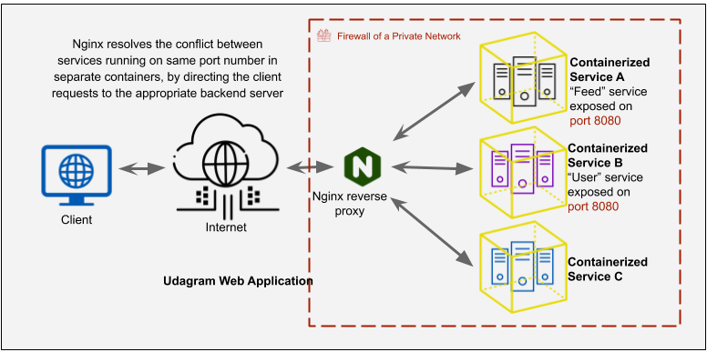

# Instapet

Social networking that about pet's life. This is the place where you can share all their hapiness and funny moments. 

## Architect

The app contains a frontend app using Ionic framework and the backend which include a bunch of micro services that is used nodejs and type script. All the app will be hosted on kubernetes on AWS. 

## Dependencies

#### Cloud Services
    1.  AWS Relational database service PostgreSQL
    2.  AWS Resource hosting and deployments.
    3.  AWS IAM account.
    4.  AWS Cognito for authentication and registration.
    5.  AWS EKS for hosting the backend and frontend.

#### DevOps tools

    1.  Kubernetes
    2.  Docker
    3.  Travis(CI/CD)

#### Frameworks
    1.  Ionic (Typescript) frontend app.
    2.  Node.js (Typescript) backend app.
    3.  Nginx to proxy to multiple backend services.


## How to run locally

### Run individual service

##### Frontend app
    Prerequisite:
        1.  brew install node
        2.  npm install -g ionic/cli

Run the frontend app
```bash
    #install all dependencies first.
    npm install
    #install 
    ionic serve
```
Open browser at http://localhost:8100

##### Backend app
    Prerequisite:
        1.  brew install node

Run the backend app
```bash
    #install all dependencies first.
    npm install
    #install 
    npm run dev
```
Open browser at http://localhost:8080

### Run all services and frontend at once on Docker container
```bash
    #make sure all the environment variable is up to date.
    source ~/.profile
    #build individual image for each service.
    docker build -t dockerhub_username/app-name .
    #find all images
    docker image ls
    #remove image
    docker image rm -f image_name/id
    #clean all images
    docker image prune
```
```bash
    #run container with env variable
    docker run --rm --publish 8080:8080 -v $HOME/.aws:/root/.aws --env POSTGRESS_HOST=$POSTGRESS_HOST --env POSTGRESS_USERNAME=$POSTGRESS_USERNAME --env POSTGRESS_PASSWORD=$POSTGRESS_PASSWORD --env POSTGRESS_DATABASE=$POSTGRESS_DATABASE --env AWS_REGION=$AWS_REGION --env AWS_PROFILE=$AWS_PROFILE --env AWS_BUCKET=$AWS_BUCKET --env JWT_SECRET=$JWT_SECRET --name feed dockerhub_username/instapet-feed

    #check container
    curl http://localhost:8080/api/v0/feed
```
```bash
    docker container ls
    docker container kill <container_name>
    docker container prune
```

```bash
    #build all image front end and backend
    docker-compose -f docker-compose-build.yaml build --parallel
    #run
    docker-compose up
    #stop
    docker-compose stop
    #remove
    docker-compose down
```

```bash
    #debug container
    docker logs image-name
    #continuously seeing the log
    docker logs image-name --follow
    #debug inside container
    docker exec -it image-name bash
```

```bash
    #publish image to registry
    docker push dockerhub_username/image-name
```
### Run all services and frontend at once on kubernetes

#### Prerequisite
    Tools needed

        1.  minikube
        2.  kubeone
        3.  kubectl

    Setup
        1. Setup credentials for aws
        2. create infrastructure
 Follow [kubeone link](https://github.com/kubermatic/kubeone/blob/master/docs/quickstart-aws.md) or [AWS EKS CLI](https://github.com/weaveworks/eksctl) 


#### Deployment

```bash
    kubectl apply -f reverseproxy-deployment.yaml
```
