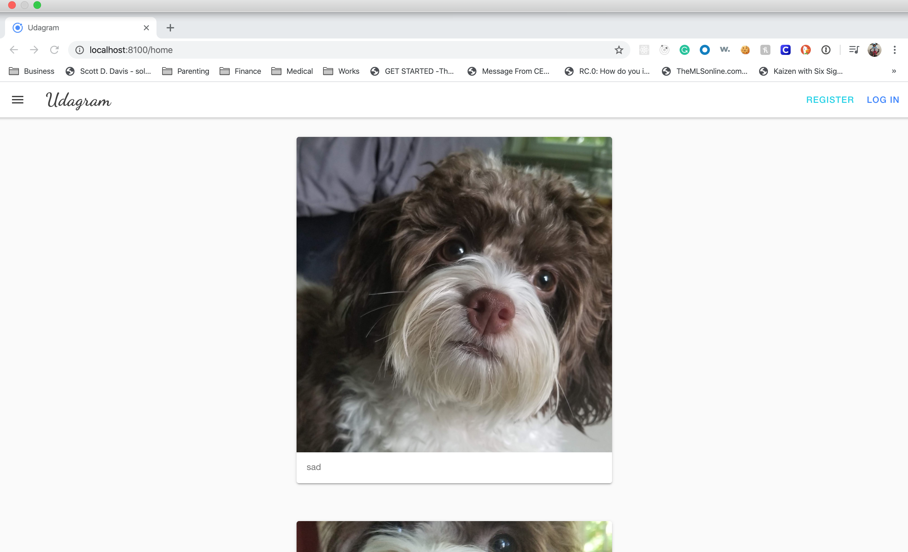
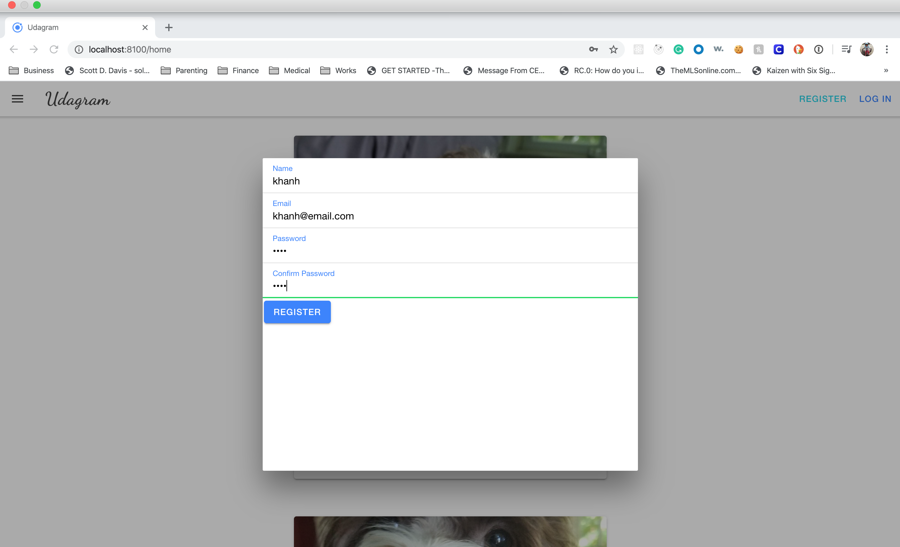
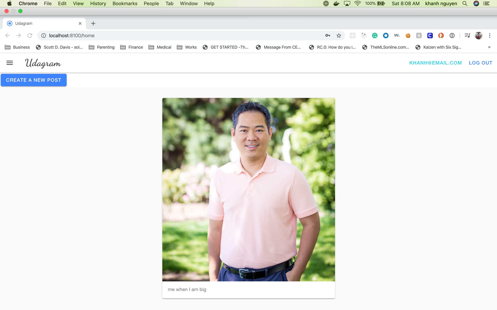
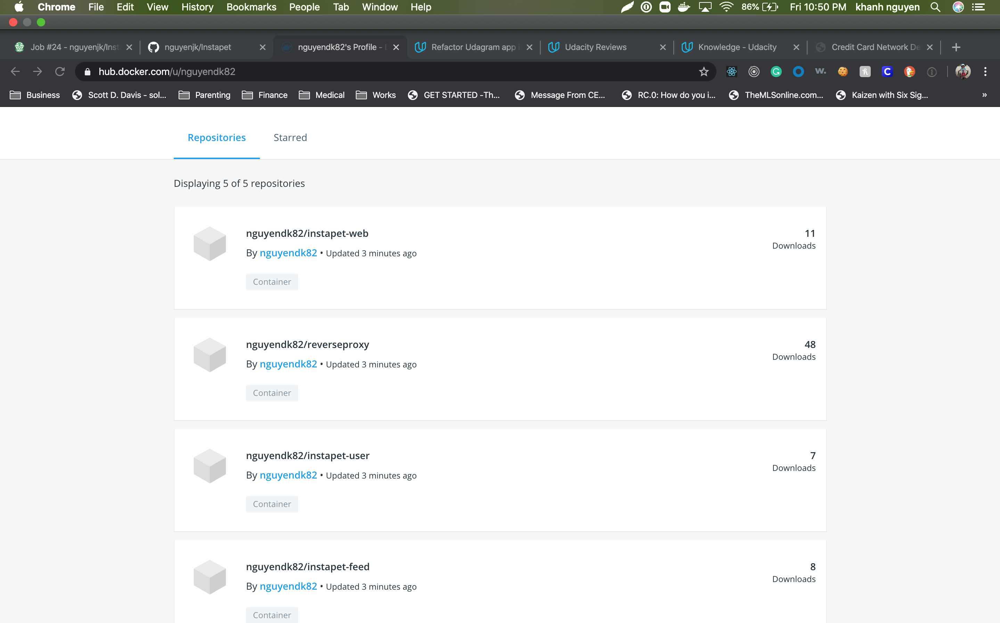
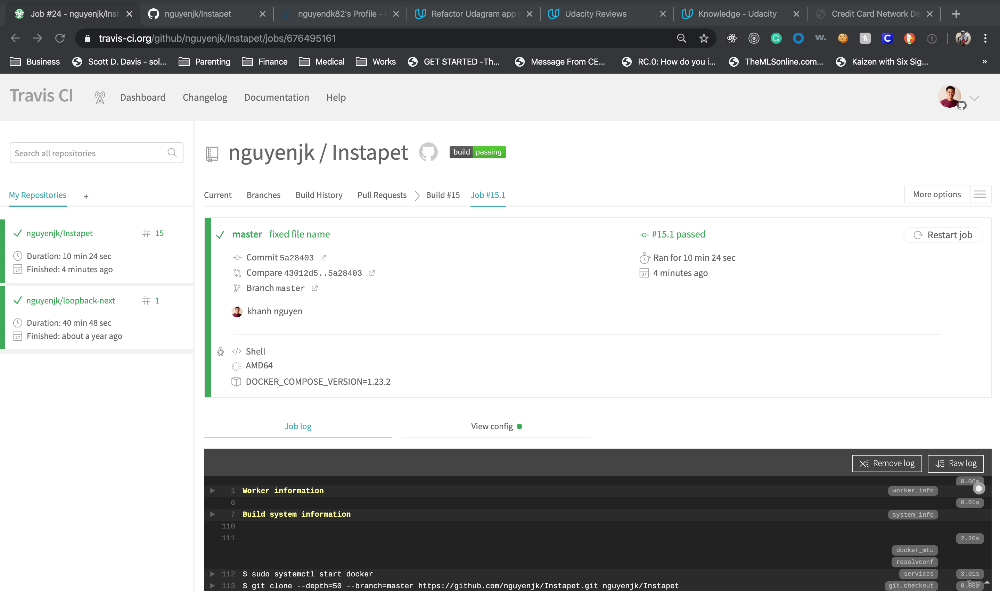
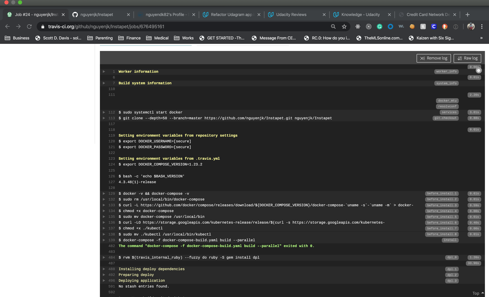
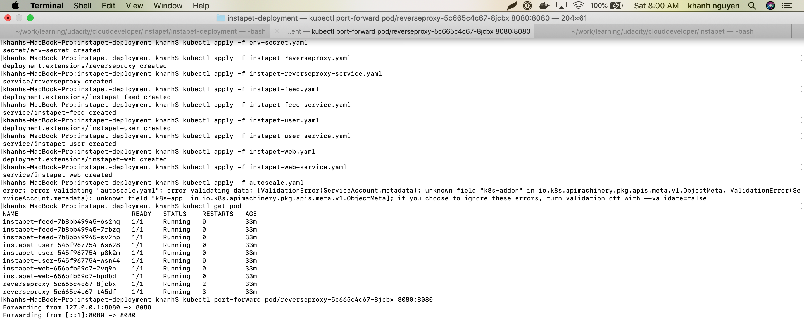
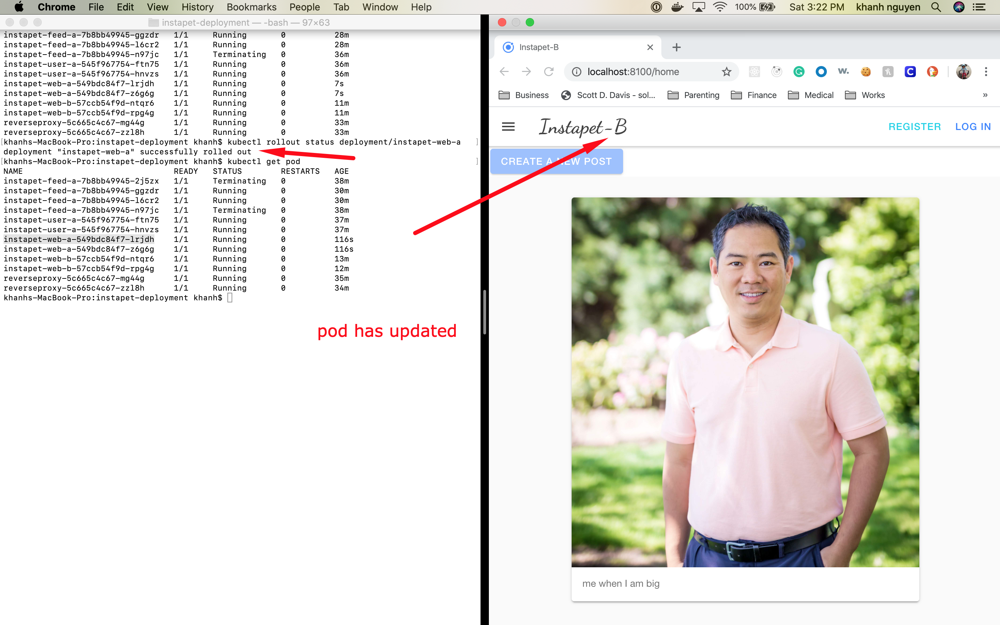
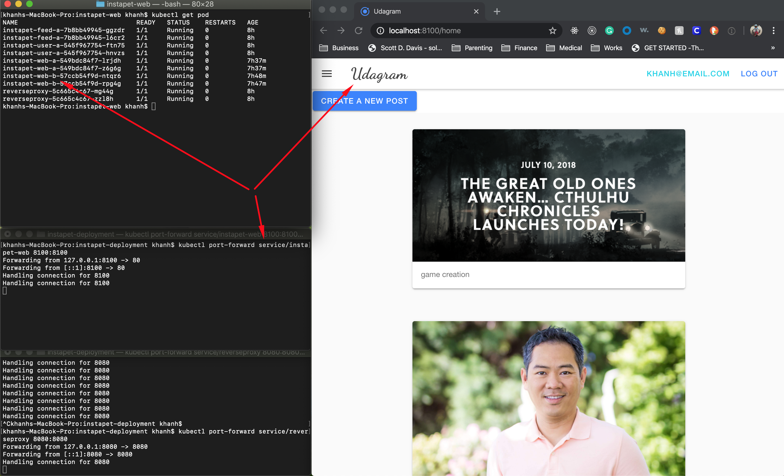

## Screen shot of all the application and deployment.

### Application overral.

1.  The application

    

    

    

2.  Docker images and docker hub.

    

3.  Travis build

    

    

4.  Kubernestes deployment

    

5.  Rollout update without interrupting service.

    

6.  AB testing

    